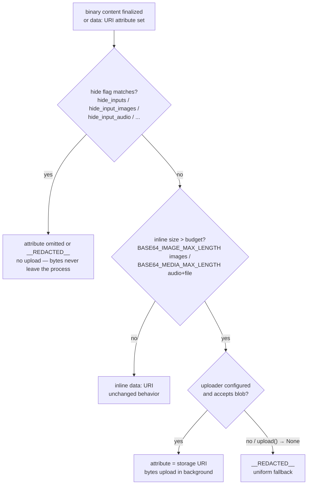
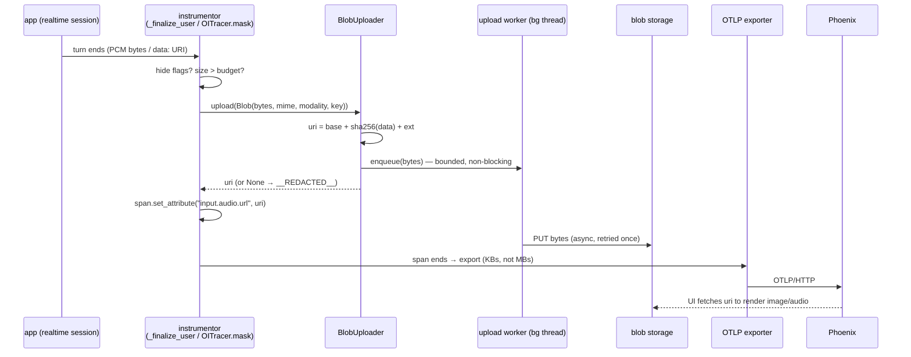

# Blob upload for large multimodal span content

**Status:** design proposal
**Demos:** [`scripts/`](./scripts/README.md) — live demos against a local Phoenix (requires `OPENAI_API_KEY`)
**Scope:** Python first; JS/Java noted as follow-on. Audio + image demonstrated; file/PDF covered by the same conventions.

## TL;DR

Large multimodal content (audio, images, PDFs) currently rides on spans as inline
`data:<mime>;base64,...` values that either get destroyed by size guards or blow up
span sizes. This design adds a pluggable **`BlobUploader`**: decoded bytes go to
external storage at capture time and the span attribute records only the destination
URI.

### What changes

New public API in `openinference-instrumentation`:

```python
Blob(data, mime_type, modality="", attribute_key=None, content_sha256="")  # frozen dataclass
BlobUploader          # @runtime_checkable Protocol: upload(blob) -> Optional[str]; shutdown(timeout_sec)
FsspecBlobUploader    # packaged default: content-addressed {base_path}/{sha256}.{ext},
                      # bounded queue + background worker; s3:// gs:// file:// local
```

New `TraceConfig` fields (each with an env var, precedence code > env > default):

| field | env var | default |
|---|---|---|
| `blob_uploader` | `OPENINFERENCE_BLOB_UPLOAD_BASE_PATH` builds the packaged `FsspecBlobUploader` (+ `OPENINFERENCE_BLOB_UPLOAD_MAX_QUEUE_SIZE`, default 20) | `None` |
| `base64_media_max_length` (audio/file/video budget; images keep `base64_image_max_length`) | `OPENINFERENCE_BASE64_MEDIA_MAX_LENGTH` | `32_000` |
| `hide_input_audio` / `hide_output_audio` / `hide_input_files` | `OPENINFERENCE_HIDE_INPUT_AUDIO` / `..._OUTPUT_AUDIO` / `..._INPUT_FILES` | `False` |

One policy, applied inside the existing `TraceConfig.mask()` choke point (and by a
direct capture-time API for instrumentors that hold raw bytes):

> **hide** (never uploaded) → **fits inline budget** (stays a data URI) →
> **upload** (attribute = storage URI) → **`__REDACTED__`** (uniform fallback —
> no uploader, rejection, and failure all degrade to today's redaction, never block).

Semconv additions: `MESSAGE_CONTENT_AUDIO`, `MESSAGE_CONTENT_FILE`, a `"file"`
content type, `FileAttributes` (`file.url` / `file.mime_type` / `file.name` /
`file.id`), and gen_ai modality `"document"`. Upload granularity is **one `Blob` per
media content part** — contract details in §2.1.

### What the span looks like

Image in a chat message — same attribute key in every state, only the value changes:

```
# today, default config (>32k base64):        content destroyed
llm.input_messages.0.message.contents.1.message_content.image.image.url = "__REDACTED__"

# today, raised limit:                         ~884 KB attribute on one span
llm.input_messages.0.message.contents.1.message_content.image.image.url = "data:image/png;base64,iVBORw0K..."

# with a BlobUploader:                         URI only; bytes in the blob store
llm.input_messages.0.message.contents.1.message_content.image.image.url = "s3://my-bucket/oi-media/3a7bd3….png"
```

Realtime voice turn (openai-agents, PR #3173 shape) — USER span:

```
# today:  data:audio/wav;base64,... truncated at 32,000 chars ≈ 0.5 s of audio
input.audio.url        = "data:audio/wav;base64,UklGRv////9..."   (cut mid-stream, not decodable)
# with a BlobUploader:  full audio survives
input.audio.url        = "s3://my-bucket/oi-media/9c2f41….wav"
input.audio.mime_type  = "audio/wav"
input.audio.transcript = "What's the weather like in Paris right now?"
```

With `enable_genai_semconv=True` the dual-write emits a spec-shaped part with no
extra work: `{"type": "uri", "modality": "audio", "mime_type": "audio/wav", "uri": "s3://…"}`.

### Likely objections, answered up front

| Objection | Short answer | Details |
|---|---|---|
| "So every instrumentor needs changes?" | No. Any `OITracer` instrumentor gets offload for media it already captures with **zero diff** (proven against released packages). Only raw-bytes capture sites (realtime PCM) and the `input.value` copy need instrumentor-side calls. | §2.2–2.3 |
| "Uploading user content is a privacy risk." | Hide flags run **before** the upload gate — hidden bytes never leave the process. This deliberately diverges from gen_ai's "hook runs independently of capture flags". | §2.4 |
| "What happens when storage is down / slow / misconfigured?" | Fail fast at construction; queue-full / shutdown / failure all degrade to today's `__REDACTED__`, synchronously, without ever blocking the app. The one residual is a bounded dangling-URI window. | §2.5 |
| "Why not adopt OTel's `UploadCompletionHook`?" | It offloads the *whole* messages JSON under unregistered `*_ref` names, making text unqueryable. We keep parts inline and reuse its good ideas (fsspec, parallel env-var names); an adapter over it is trivial via the protocol. | §3.1, §3.3 |
| "Does Phoenix break? Who renders the URIs?" | URIs are ordinary string attributes — ingestion is unchanged and already renders URL-valued image attributes. Players/signing are consumer follow-ons. | §2.7 |

### Open questions (details in §7)

1. Externalize images inside `input.value` (today's pre-pass redacts them).
2. Realtime `input.audio.*` keys: promote to semconv, or migrate onto `message_content.audio`?
3. Re-align if OTel GenAI standardizes external-reference recording.
4. Optional "archive but don't show" flag for hidden content.

---

## 1. Problem

OpenInference spans capture multimodal content **inline** as `data:<mime>;base64,...`
attribute values. That worked for occasional small images; it does not survive contact
with production voice traces.

The forcing function is realtime audio tracing for openai-agents
([PR #3173](https://github.com/Arize-ai/openinference/pull/3173)). The OpenAI Realtime
API streams 24 kHz mono PCM16 both directions — **48 KB/s of raw audio per side, 64 KB/s
once base64-encoded**. Today the instrumentor caps the inline payload at
`OPENINFERENCE_BASE64_AUDIO_MAX_LENGTH` (default 32,000 chars), which preserves roughly
**half a second** of audio: a 3.2 s utterance encodes to ~205,000 base64 chars, of which
the cap keeps 32,000 — and the cut lands mid-stream, so the survivor is not even valid
base64/WAV. Production choices today:

| today's option | consequence |
|---|---|
| default truncation (audio) / redaction (image) | content destroyed — a 3.2 s question keeps ~0.5 s of unplayable audio; a >32 KB image becomes `__REDACTED__` |
| raise the max-length env vars | a 663 KB PNG becomes an 884 KB attribute; one 8 s voice turn adds ~512 KB of base64; multi-MB spans stress OTLP payload limits (gRPC default rejects the whole 4 MB+ batch), collectors, and span stores |
| hide flags (`OPENINFERENCE_HIDE_INPUT_AUDIO`, …) | attribute never emitted — no observability at all |

The missing option, and the subject of this spec: **upload the decoded bytes to external
storage at capture time and record only the destination URI on the span**.

### Current inline capture surface

| content | attribute (span) | who writes it | oversized behavior today |
|---|---|---|---|
| realtime audio (input / output) | `input.audio.url` on the USER span, `output.audio.url` on the LLM span (+ `.mime_type`, `.transcript`) | openai-agents `_realtime.py` `_finalize_user` / `_finalize_response` (instrumentor-local constants, not yet semconv) | truncated data URI, prefix preserved |
| image in a message | `llm.{input,output}_messages.{i}.message.contents.{j}.message_content.image.image.url` | any multimodal instrumentor via `OITracer` | input images: `__REDACTED__` when base64 length > `base64_image_max_length` (`TraceConfig.mask()`); output images: no limit applied |
| audio in a message | `...message_content.audio.audio.url` (spec'd in `spec/multimodal_attributes.md`; no semconv constant yet) | (rarely emitted today) | no masking rule exists — `TraceConfig` only matches `data:image/` |

Two structural facts shape the design:

- Every attribute set on an `OITracer`-created span already flows through a single
  choke point, `TraceConfig.mask(key, value)`
  (`openinference-instrumentation/src/openinference/instrumentation/_spans.py:43`).
  That is where image redaction happens today — and where offload can happen tomorrow
  with **zero instrumentor changes**.
- The realtime instrumentor holds **raw PCM bytes**, not data URIs, until the final
  encode at `_finalize_user` / `_finalize_response`. Forcing it through a data-URI
  round-trip just so the choke point can decode it again would double memory churn on a
  hot path, so it also needs a direct capture-time API.

## 2. Proposed design

### 2.1 Interface

New module in the core `openinference-instrumentation` package, public exports
`Blob`, `BlobUploader`, `FsspecBlobUploader` (the demos carry a local copy in
[`scripts/common.py`](./scripts/common.py) since released packages don't ship them yet):

```python
@dataclass(frozen=True)
class Blob:
    data: bytes                          # decoded bytes — never base64 text
    mime_type: str                       # "audio/wav", "image/png", ...
    modality: str = ""                   # "image"|"audio"|"video"|"document";
                                         # derived from mime_type when omitted
    attribute_key: Optional[str] = None  # span attribute the ref lands on
    content_sha256: str = ""             # hex digest of data; computed automatically


@runtime_checkable
class BlobUploader(Protocol):
    def upload(self, blob: Blob) -> Optional[str]: ...
    def shutdown(self, timeout_sec: float = 10.0) -> None: ...
```

`modality` maps straight onto the gen_ai part `modality` field; `content_sha256` is
computed once so neither the caller nor the uploader re-hashes. Span/trace ids are
deliberately **not** part of `Blob`: content-addressed storage means the same payload
referenced from two traces is one object, so per-trace layouts don't compose with dedup.

Contract for `upload`:

- **One `Blob` per media content part — a single uploader serves every mime type.**
  The unit of upload is the individual binary part behind one span attribute, not the
  span, the message, or the mime type. There is no per-mime-type registry: the one
  configured uploader receives all parts, and `blob.mime_type` / `blob.modality` exist
  so an implementation can *route* (e.g. per-modality prefixes) or *refuse* (return
  `None` → that part alone redacts; siblings unaffected) as its own policy. Unknown
  mime types need no configuration — they upload with a `.bin` fallback extension.
- **MUST return quickly.** Compute the destination URI synchronously (content-hash
  naming); transfer bytes on a background worker. Capture sites sit on the realtime
  websocket event path.
- **`None` means "not uploaded — redact".** On backpressure (bounded queue full),
  after shutdown, or by uploader policy, the caller records `__REDACTED__` — the same
  value oversized content gets with no uploader at all (the uniform fallback in the
  TL;DR policy line).
- **Errors never propagate.** Worker-side failures are logged (rate-limited); the app
  is unaffected. Implementations SHOULD fail fast at construction when the destination
  is unusable (missing fsspec driver → `ImportError`; a startup write probe is
  recommended).
- **Content-hash naming is the default** (`{base_path}/{sha256(data)}.{ext}`, extension
  mapped from the mime type): identical payloads dedup — significant for multi-turn
  chats that resend the same image every turn — and the URI is computable before the
  bytes land. (Dedup is per *(bytes, mime type)*, since the extension comes from the
  declared mime; a harmless corner case.)
- **`shutdown(timeout_sec)`** flushes the queue and stops workers; invoked from
  instrumentor `uninstrument()` and an `atexit` hook, next to `TracerProvider.shutdown()`.

Worked example — one user message with text, two images, and a PDF, all over budget,
produces three independent uploads and three URIs (text never uploads):

```
llm.input_messages.0.message.contents.0.message_content.text             = "Compare these…"
llm.input_messages.0.message.contents.1.message_content.image.image.url  = s3://…/9c2f41….png   (image/png)
llm.input_messages.0.message.contents.2.message_content.image.image.url  = s3://…/e01bb2….jpg   (image/jpeg)
llm.input_messages.0.message.contents.3.message_content.file.file.url    = s3://…/77aa03….pdf   (application/pdf)
```

Each part is judged against its own budget (image vs media, §2.4) and succeeds or
falls back to `__REDACTED__` independently.

`FsspecBlobUploader`, the packaged default, resolves one `base_path` for all mime
types through [fsspec](https://filesystem-spec.readthedocs.io/) (`s3://` via `s3fs`,
`gs://` via `gcsfs`, …; credentials ride each backend's standard mechanisms). fsspec
is an optional extra (`openinference-instrumentation[blob-upload]`); plain local paths
work without it, while remote schemes without the driver raise at construction rather
than dropping blobs at runtime. Per-modality destinations = a ~10-line custom uploader
dispatching on `blob.modality`.

Configuration, in precedence order:

| mechanism | proposal |
|---|---|
| programmatic | `TraceConfig(blob_uploader=my_uploader)` — new optional field accepting any `BlobUploader` |
| entry point | group `openinference_blob_uploader`, selected by `OPENINFERENCE_BLOB_UPLOADER=<name>` (mirrors `opentelemetry_genai_completion_hook` mechanics) |
| built-in default impl | `OPENINFERENCE_BLOB_UPLOAD_BASE_PATH=<fsspec URI>` constructs the packaged `FsspecBlobUploader`; `OPENINFERENCE_BLOB_UPLOAD_MAX_QUEUE_SIZE` (default 20) bounds it — names deliberately parallel OTel's `OTEL_INSTRUMENTATION_GENAI_UPLOAD_*` |

### Two integration points, chosen per capture site

The uploader has two doors. They are **not deployment alternatives** — the door is
picked per capture site by one question: *what form is the media in at the moment the
instrumentor is about to record it?* One instrumentor routinely uses both; the OpenAI
instrumentor does (point 1 for structured attributes, point 2 for the `input.value`
copy). Point 1 is the default and costs nothing; point 2 is deliberate per-instrumentor
work taken on only when the bytes-form or the JSON-blob situation forces it.

| Media at the capture site | Door |
|---|---|
| SDK hands you base64 (`image_url`, `input_audio.data`, `file_data` — JSON APIs can't carry raw bytes) | **point 1** — emit a data URI on the standard key; `mask()` does the rest |
| raw decoded bytes (realtime / websocket buffers) | **point 2** — `upload(Blob)` directly; skip the bytes → base64 → bytes round-trip |
| payload inside an already-serialized JSON attribute (`input.value`) | **point 2** — pre-pass before serialization |
| provider-hosted reference (`file.id`, `file_url`) | **neither** — record the reference verbatim; no bytes involved |

Whichever door, §2.4's policy applies identically — same gate order, same uniform
fallback, errors caught at both — so a payload's fate depends only on config, never on
which door it entered through.

### 2.2 Integration point 1 — the `TraceConfig` choke point (zero instrumentor changes)

`TraceConfig.mask()` already sees every `(key, value)` on `OITracer` spans and already
implements the >limit image redaction. Add one branch **ahead of** the redaction
branches:

```python
# inside TraceConfig.mask(), after all hide_* branches, before redact:
if (
    self.blob_uploader is not None
    and _is_offloadable_key(key)          # message_content image/audio/file URL
    and _is_base64_data_uri(value)        # data:<mime>;base64,
    and len(value) > self._max_inline_length_for(key)   # image vs media budget, §2.4
):
    mime, data = _decode_data_uri(value)
    if (uri := self.blob_uploader.upload(Blob(data=data, mime_type=mime, attribute_key=key))) is not None:
        return uri
# fall through: __REDACTED__ (uniform fallback)
```

The image demo proves this shape against the *released* packages: a real Agents SDK
vision run (Responses API underneath, instrumented by the released OpenAI
instrumentor) produces `__REDACTED__` or a short storage URI on the same attribute key
depending only on the `TraceConfig` handed to the instrumentor. Any instrumentor that
uses `OITracer` — which the project requires — gets image/audio/file offload without a
diff. (The `blob_uploader` field isn't env-parseable, so when unset it is constructed
separately from `OPENINFERENCE_BLOB_UPLOAD_BASE_PATH`.)

**The `input.value` copy.** Instrumentors also JSON-serialize the whole raw request
into `input.value` *before* it reaches `mask()`, and `mask()` won't parse arbitrary
JSON to find base64 buried inside. The OpenAI instrumentor already solves this for
images with an instrumentor-side pre-pass (`redact_images_from_request_parameters`)
that redacts oversized base64 images from the serialized copy. This design generalizes
that pre-pass to audio and file parts and hands it the same uploader, so one
hide → externalize → redact policy covers both the structured attribute and the
`input.value` copy; content addressing collapses the double touch into one object and
one URI. Upgrading the *image* pre-pass from redaction to externalization is open
question 1. The realtime instrumentor is unaffected — its `input.value` carries
transcripts only.

### 2.3 Integration point 2 — capture-time API for raw-bytes instrumentors

Instrumentors that hold decoded bytes call the uploader directly and never build a
data URI. For openai-agents realtime, both audio sinks (`_realtime.py:876-881` and
`:842-848`) change the same way:

```python
# today (_finalize_user)
uri = pcm16_to_wav_data_uri(bytes(buf))
if len(uri) > max_len:
    uri = truncate_audio_data_uri(uri, max_len)
user_span.set_attribute(_INPUT_AUDIO_URL, uri)

# proposed
if inline_would_exceed_budget(len(buf)):
    uri = uploader.upload(Blob(
        data=pcm16_to_wav_bytes(bytes(buf)),
        mime_type="audio/wav",
        attribute_key=_INPUT_AUDIO_URL,
    )) if uploader else None
    uri = uri or REDACTED_VALUE          # uniform fallback
else:
    uri = pcm16_to_wav_data_uri(bytes(buf))
user_span.set_attribute(_INPUT_AUDIO_URL, uri)
```

`input.audio.mime_type`, `input.audio.transcript`, and the hide-flag gating are
untouched. The audio demo applies exactly this change to a **live realtime session**
by patching the capture site in the released instrumentor (run it with `--inline` to
see today's truncation on the same session). One migration behavior change:
over-budget audio that cannot upload becomes `__REDACTED__` instead of today's
truncated data URI — acceptable because the truncated payload is cut mid-stream and
was never decodable audio.

### 2.4 Offload policy

One decision function, applied at both integration points:



- **Privacy wins over upload.** Hidden content is never uploaded — uploading it would
  move PII into storage the operator explicitly asked to suppress. This intentionally
  diverges from gen_ai's "hook operates independently of capture opt-in flags": that
  clause exists so a hook can be the *sole* content sink in OTel's opt-in-capture
  world, whereas OI captures by default and its `hide_*` flags are redaction controls.
- **Two inline budgets.** Images keep the existing `base64_image_max_length`
  (back-compat); audio/file/video share the new `base64_media_max_length` (default
  32,000). Content that fits its budget stays inline (tiny blobs aren't worth a
  fetch); content over budget uploads. Set a budget to `0` to offload everything.
  Realtime's private `OPENINFERENCE_BASE64_AUDIO_MAX_LENGTH` migrates onto
  `base64_media_max_length`.
- **Over-budget content that cannot upload is `__REDACTED__`** (§2.1) — enabling an
  uploader only ever upgrades redaction to a URI.
- **Unsampled/non-recording spans skip upload** (`span.is_recording()` guard) — no
  paying for uploads nobody can see; a sampled-out span has no attribute to dangle.

### 2.5 Async model and failure modes

`upload()` stamps the URI now; bytes travel later (OTel's util-genai stamps refs the
same way).

| failure | behavior | who notices |
|---|---|---|
| storage unusable at construction | fail fast and loud: `ImportError` for a missing fsspec driver; recommended startup write probe → uploader disables itself, one log | operator; oversized media redacts, as with no uploader |
| bounded queue full (burst) | `upload()` returns `None` synchronously → attribute records `__REDACTED__` | span shows redacted content — never silently empty, never blocked |
| async write fails after URI stamped | retry-once then log; span carries a dangling URI | backend shows broken link for that one blob; transcript/mime survive on the span |
| process exits mid-queue | `atexit` → `shutdown(timeout_sec)` flush; still-pending blobs may be lost (dangling URIs) | same as above |
| uploader raises | caught at both integration points, logged, redaction fallback | never the application |
| memory pressure | bound = queue_capacity × largest blob; realtime turns are ~100s of KB → ~MBs at default capacity | operator tuning |

The dangling-URI window is the deliberate price of never blocking the hot path;
consumers should treat "object not (yet) there" as retryable. Deployments that cannot
tolerate it can pass a custom `BlobUploader` that writes synchronously.

### 2.6 End-to-end flow



### 2.7 Backend consumption (Phoenix)

URIs are ordinary string attributes — no Phoenix changes are required to store them.

- **Images:** `SpanDetails.tsx` already renders `message_content.image.image.url`
  through `<SpanImage>` for any URL; the after-state renders whenever the browser can
  resolve the URI (https / signed URLs / same-origin proxy — out of scope here).
- **Audio:** Phoenix has no span-details audio player yet (`isAudioUrl` in
  `urlUtils.ts` is unused); the URI shows in the attributes pane. A player is a
  natural follow-on once URIs are the norm.
- **Access control** (signed URLs, retention, cross-origin) is the storage backend's
  concern, intentionally outside this design.

## 3. Compatibility with the OTel GenAI conventions

### 3.1 What the convention specifies

[`gen-ai-spans.md` § "Uploading content to external storage"](https://github.com/open-telemetry/semantic-conventions-genai/blob/main/docs/gen-ai/gen-ai-spans.md#uploading-content-to-external-storage)
(development status), in short: instrumentations **MAY** support in-process upload
hooks; the hook **SHOULD** run independently of content-capture opt-ins and sampling,
**SHOULD** be able to modify the span and message objects (modified values win), and
the hook API **SHOULD** be generic — sync vs async, reference recording, everything
else is the implementation's responsibility. Crucially, *"TODO: document a common
approach to record references to externally stored content"* is still open
([#45](https://github.com/open-telemetry/semantic-conventions-genai/issues/45)) —
**there is no normative reference-attribute convention to comply with.**

The reference implementation, `opentelemetry-util-genai`'s
[`CompletionHook`](https://github.com/open-telemetry/opentelemetry-python-contrib/blob/main/util/opentelemetry-util-genai/src/opentelemetry/util/genai/completion_hook.py),
uploads the **whole** message lists once per invocation, stamps
`gen_ai.input.messages_ref` / `gen_ai.output.messages_ref` (de-facto names, not in the
registry) immediately — before the write completes — and drops with a warning when its
bounded queue is full; configured via `OTEL_INSTRUMENTATION_GENAI_COMPLETION_HOOK=upload`
and `OTEL_INSTRUMENTATION_GENAI_UPLOAD_BASE_PATH`. An earlier *generic* `BlobUploader`
proposal ([python-contrib#3065](https://github.com/open-telemetry/opentelemetry-python-contrib/issues/3065):
`upload_async(blob) -> url` returning the destination immediately — the shape adopted
here) was closed in favor of the hook after concerns about unsampled-span uploads and
in-memory buffering; §2.4's `is_recording()` guard and §2.5's bounded queue answer both.

### 3.2 Attribute mapping (audio, image, file)

The gen_ai message schemas define three binary content-part types (each with
`mime_type` and `modality` `image|audio|video|document`):

| part | shape | meaning |
|---|---|---|
| `blob` | `{type:"blob", content:<base64>, mime_type, modality}` | raw bytes inline |
| `uri` | `{type:"uri", uri, mime_type, modality}` | external reference; explicitly *"should not be a base64 data URL"* |
| `file` | `{type:"file", file_id, mime_type, modality}` | provider-side pre-uploaded file id |

OpenInference's dual-write (`_genai_conversion.py::_image_part_from_url`) already maps
OI URLs onto these — `data:` URL → `blob` part, anything else → `uri` part — so
**after blob upload the dual-write emits a `uri` part with no conversion changes.**
OI attribute keys don't change either; the URI replaces the data URI in place:

| content | OI attribute (key unchanged) | before | after | gen_ai dual-write |
|---|---|---|---|---|
| message image | `...message_content.image.image.url` | `data:image/png;base64,...` or `__REDACTED__` | storage URI | `blob` part → `uri` part (`modality:"image"`) |
| message audio | `...message_content.audio.audio.url` (+ `audio.mime_type`, `audio.transcript`) | `data:audio/wav;base64,...` | storage URI | `uri` part (`modality:"audio"`); conversion generalizes `_image_part_from_url` to `_media_part_from_url` |
| message file / PDF | `...message_content.file.file.url` (+ `file.mime_type`, `file.name`); provider-hosted files as `file.id`, a reference with no bytes | `data:application/pdf;base64,...` | storage URI | `uri` part (`modality:"document"`); `file.id` → `file` part |
| realtime audio (input / output) | `input.audio.url` / `output.audio.url` + `.mime_type`, `.transcript` | truncated data URI | storage URI; mime + transcript unchanged | n/a today (realtime spans are not dual-written; follow-on) |

Supporting details:

- **Semconv additions this design ships** (so mask rules match constants, not
  strings): `MESSAGE_CONTENT_AUDIO`, `MESSAGE_CONTENT_FILE`, the `"file"` content
  type, `FileAttributes`, and gen_ai modality `"document"`. Still open: the realtime
  `input.audio.*` keys (open question 2).
- **mime type:** audio and files carry `*.mime_type` fields; images embed mime in the
  data URI today, so uploaders MUST append a mime-derived extension (`….png`) to keep
  the URI self-describing. Add `image.mime_type` later only if that proves
  insufficient.
- **size:** upstream is discussing `byte_size` on content parts
  ([PR #143](https://github.com/open-telemetry/semantic-conventions-genai/pull/143));
  adopt if it lands rather than inventing an OI field.
- **Caveat, stated for honesty:** gen_ai defines `uri`/`file` parts as "what was sent
  to the provider", not "where telemetry offloaded the bytes". The convention
  explicitly allows the hook to rewrite message objects (blob → uri), and Google's
  deployed hook relies on the same mutability, but no convention blesses per-part
  rewrites yet — track [#45](https://github.com/open-telemetry/semantic-conventions-genai/issues/45)
  / [#304](https://github.com/open-telemetry/semantic-conventions-genai/issues/304)
  and re-align if they land (open question 3).
- **Conformance:** add a uri-part scenario to the Weaver `registry live-check` harness
  (`python/openinference-instrumentation/scripts/conformance/`) and schema-validate
  converted parts against the vendored GenAI JSON schemas.

### 3.3 Alternative considered: whole-payload refs

| | util-genai (whole payload) | Langfuse / Traceloop / **this proposal** (per part) |
|---|---|---|
| what uploads | entire messages JSON per invocation | only the binary part's bytes |
| span afterwards | content attrs *plus* `*_ref` attrs | same attribute keys, URI values |
| text queryability | moves to storage with everything else | text stays inline and queryable |
| backend rendering | needs new `_ref`-aware UI | Phoenix already renders URL-valued `image.image.url` |
| dedup | uuid per invocation | content hash dedups the same image resent every turn |

Per-part rewrite wins because OI's attribute model is already flat per-part URL fields
that accept both `data:` and external URIs, and Phoenix renders them today. A
whole-payload `messages_ref` equivalent (offloading entire conversations) is
compatible follow-on work.

## 4. Demos

Two live scripts under [`scripts/`](./scripts/README.md), run with
`uv run --script …` against a locally running Phoenix; both require `OPENAI_API_KEY`
and drive **real instrumented OpenAI Agents SDK apps** — no hand-built spans:

- **`image_blob_demo.py`** — a vision agent (`Agent` + `Runner.run` with an
  `input_image`), instrumented at both layers (openai-agents for the agent spans, the
  OpenAI instrumentor for the Responses API LLM span). The same run executes twice
  with only the `TraceConfig` changed: default config redacts the >32 KB image; the
  blob-upload config records the store path on the same attribute key.
- **`audio_blob_demo.py`** — a **live Realtime API session** (`RealtimeAgent` +
  `RealtimeRunner`): a TTS-spoken question goes in, the assistant answers in audio,
  and the released realtime instrumentation emits the AUDIO/USER/LLM span tree with
  real transcripts and token counts. The §2.3 capture-site change is applied as a
  patch on the released instrumentor; `--inline` runs the same session with today's
  truncation instead.

The demo blob store (`LocalBlobStore` in `common.py`, next to the proposed interface
definitions) is a deliberate mock: content-addressed files in the local repo, with the
repo-relative path returned as the URI — resolving/rendering URIs is the backend's
concern (§2.7).

## 5. JS / Java follow-on (not implemented)

The design ports directly: both ecosystems have the same two seams.

- **JS** (`@arizeai/openinference-core`): `OITracer`'s mask/config pipeline gains the
  same `blobUploader` config field and choke-point branch; interface
  `upload(blob: Blob): string | null` with a bounded async queue.
- **Java** (`openinference-instrumentation` `TraceConfig`): same field + branch;
  `BlobUploader` as an interface with an `ExecutorService`-backed default.

Attribute keys and policy are language-independent; only the uploader plumbing is
per-language work.

## 6. Out of scope

- Production object stores (S3/GCS credentials, signed URL issuance, retention/GC,
  encryption at rest). The demo backend is a local directory returning repo-relative
  paths.
- A file/PDF demo — the conventions and mask rules cover `file` parts (§3.2); no demo
  script in this iteration.
- Phoenix UI changes (audio player, blob-store proxy).
- Whole-payload `messages_ref`-style offload (§3.3).
- The openai-agents realtime migration itself (§2.3 is the plan; landing it is a
  follow-on PR).

## 7. Open questions

1. **Images inside `input.value`.** The OpenAI instrumentor's existing
   `redact_images_from_request_parameters` pre-pass already redacts oversized images
   from the serialized request (verified in the image demo). The generalized
   audio/file pre-pass (§2.2) externalizes through the uploader; unify by teaching the
   image pre-pass to do the same, so the `input.value` copy carries the URI instead of
   a redaction marker.
2. **Realtime attribute keys.** Promote `input.audio.*` / `output.audio.*` to semconv
   as-is, or migrate realtime onto the `message_content.audio` conventions — the same
   motion PR #3173 anticipated ("promote to shared TraceConfig once stable").
3. **Upstream refs convention.** If
   [semantic-conventions-genai#45](https://github.com/open-telemetry/semantic-conventions-genai/issues/45)
   standardizes reference attributes (or #304 standardizes parts), revisit the §3.2
   mapping before GA.
4. **Should `hide_*` + uploader mean "archive but don't show"?** Deliberately answered
   "no" (privacy wins); a separate `archive_hidden_content` flag could add it later
   without breaking this design.
