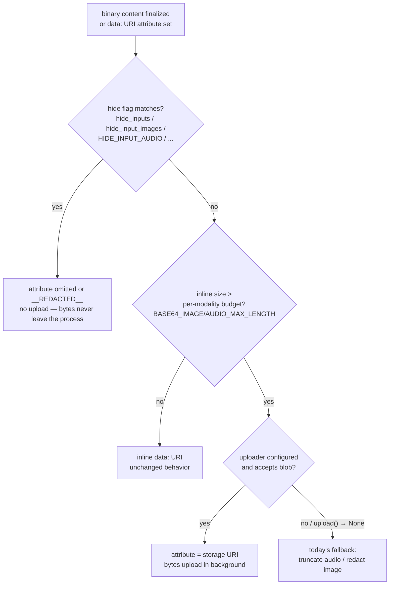
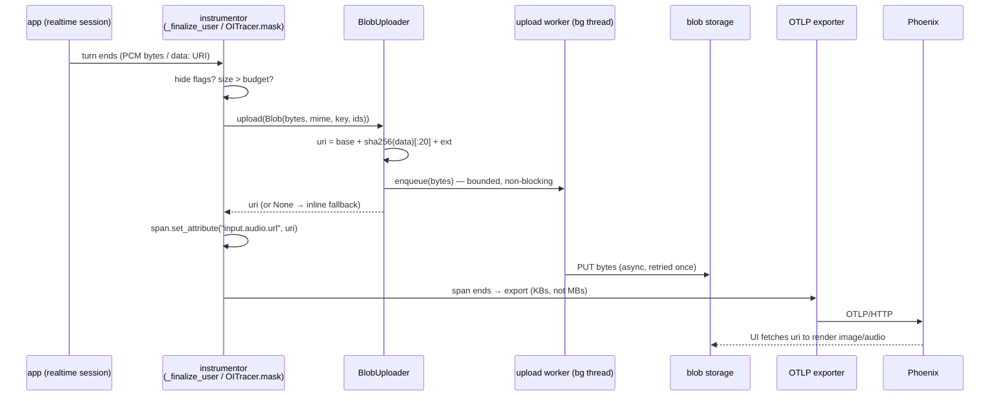

# Blob upload for large multimodal span content

**Status:** design proposal (no production code changes)
**Demos:** [`scripts/`](./scripts/README.md) — runnable before/after evidence against a local Phoenix
**Scope:** Python first; JS/Java noted as follow-on. Audio + image required; PDF/documents follow-on.

## 1. Problem

OpenInference spans capture multimodal content **inline** as `data:<mime>;base64,...`
attribute values. That worked for occasional small images; it does not survive contact
with production voice traces.

The forcing function is realtime audio tracing for openai-agents
([PR #3173](https://github.com/Arize-ai/openinference/pull/3173)). The OpenAI Realtime
API streams 24 kHz mono PCM16 both directions — **48 KB/s of raw audio per side, 64 KB/s
once base64-encoded**. Today the instrumentor caps the inline payload at
`OPENINFERENCE_BASE64_AUDIO_MAX_LENGTH` (default 32,000 chars), which preserves roughly
**half a second** of audio. The demo makes this concrete: a 3.2 s utterance keeps
32,000 of 204,860 base64 chars, and the truncation cuts mid-stream so the survivor is
not even valid base64/WAV. Production choices today:

| today's option | consequence |
|---|---|
| default truncation (audio) / redaction (image) | content destroyed — a 3.2 s question keeps ~0.5 s of unplayable audio; a >32 KB image becomes `__REDACTED__` |
| raise the max-length env vars | a 663 KB PNG becomes an 884 KB attribute; one 8 s voice turn adds ~512 KB of base64; multi-MB spans stress OTLP payload limits, collectors, and span stores |
| hide flags (`OPENINFERENCE_HIDE_INPUT_AUDIO`, …) | attribute never emitted — no observability at all |

The missing option, and the subject of this spec: **upload the decoded bytes to external
storage at capture time and record only the destination URI on the span**.

### Current inline capture surface

| modality | attribute (span) | who writes it | oversized behavior today |
|---|---|---|---|
| realtime input audio | `input.audio.url` (+ `.mime_type`, `.transcript`) on the USER span | openai-agents `_realtime.py` `_finalize_user` (instrumentor-local constants, not yet semconv) | truncated data URI, prefix preserved |
| realtime output audio | `output.audio.url` (+ `.mime_type`, `.transcript`) on the LLM span | openai-agents `_realtime.py` `_finalize_response` | truncated data URI |
| image in a message | `llm.{input,output}_messages.{i}.message.contents.{j}.message_content.image.image.url` | any multimodal instrumentor via `OITracer` | input images: `__REDACTED__` when base64 length > `base64_image_max_length` (`TraceConfig.mask()`); output images: no limit applied |
| audio in a message | `...message_content.audio.audio.url` (spec'd in `spec/multimodal_attributes.md`; no semconv constant yet) | (rarely emitted today) | no masking rule exists — `TraceConfig` only matches `data:image/` |

Two structural notes that shape the design:

- Every attribute set on an `OITracer`-created span already flows through a single
  choke point, `TraceConfig.mask(key, value)`
  (`openinference-instrumentation/src/openinference/instrumentation/_spans.py:43`).
  That is where image redaction happens today — and where offload can happen tomorrow
  with **zero instrumentor changes**.
- The realtime instrumentor holds **raw PCM bytes**, not data URIs, until the final
  encode at `_finalize_user` / `_finalize_response`. Forcing it through a data-URI
  round-trip just so the choke point can decode it again would double memory churn on a
  hot path, so it also needs a direct capture-time API.

## 2. gen_ai compatibility analysis

### 2.1 What the OTel GenAI convention specifies

[`gen-ai-spans.md` § "Uploading content to external storage"](https://github.com/open-telemetry/semantic-conventions-genai/blob/main/docs/gen-ai/gen-ai-spans.md#uploading-content-to-external-storage)
(development status) says, in short:

- Instrumentations **MAY** support user-defined in-process hooks to handle content upload.
- The hook **SHOULD** operate independently of the content-capture opt-in flags, and
  **SHOULD** be invoked regardless of sampling, with the structured (pre-JSON) messages
  and the span instance.
- The hook **SHOULD** be able to enrich and modify the span and message objects; content
  attributes are recorded **after** the hook so modified values win.
- The hook API **SHOULD** be generic — sync vs async upload, recording references, and
  everything else is the implementation's responsibility.
- *"TODO: document a common approach to record references to externally stored content"*
  — tracked as [semantic-conventions-genai#45](https://github.com/open-telemetry/semantic-conventions-genai/issues/45),
  still open. **There is no normative reference-attribute convention to comply with.**

The reference implementation is `opentelemetry-util-genai`'s
[`CompletionHook`](https://github.com/open-telemetry/opentelemetry-python-contrib/blob/main/util/opentelemetry-util-genai/src/opentelemetry/util/genai/completion_hook.py)
(né `UploadHook`) with an fsspec-backed `UploadCompletionHook`:

- one call per invocation at span finish with the **whole** structured message lists;
- destination refs stamped **immediately** (before the upload completes) as
  `gen_ai.input.messages_ref` / `gen_ai.output.messages_ref` /
  `gen_ai.system_instructions_ref` — de-facto names only, not in the registry;
- `ThreadPoolExecutor` + `BoundedSemaphore(max_queue_size)` (default 20), **drop with a
  warning** when full; hook exceptions swallowed; startup write-probe fails fast;
  `shutdown(timeout_sec=10)` flushes;
- configured via entry point group `opentelemetry_genai_completion_hook` +
  `OTEL_INSTRUMENTATION_GENAI_COMPLETION_HOOK=upload`,
  `OTEL_INSTRUMENTATION_GENAI_UPLOAD_BASE_PATH=gs://bucket/path`,
  `OTEL_INSTRUMENTATION_GENAI_UPLOAD_FORMAT=json|jsonl`.

Also relevant: an earlier, *generic* `BlobUploader` proposal in python-contrib
([#3065](https://github.com/open-telemetry/opentelemetry-python-contrib/issues/3065):
`Blob(raw_bytes, content_type, labels)`, `upload_async(blob) -> str` returning the URL
immediately, `NOT_UPLOADED` sentinel) was **closed** in favor of the hook approach after
concerns about uploading for unsampled spans, buffering large blobs in memory, and it
not being GenAI-specific. Its design record informs several choices below.

### 2.2 How gen_ai represents multimodal content

The `gen_ai.input.messages` / `gen_ai.output.messages` JSON schemas define three
content-part types for binary content (all with `mime_type` and `modality`
`image|audio|video`):

| part | shape | meaning |
|---|---|---|
| `blob` | `{type:"blob", content:<base64>, mime_type, modality}` | raw bytes inline |
| `uri` | `{type:"uri", uri, mime_type, modality}` | external reference; explicitly *"should not be a base64 data URL, which should use the `blob` part instead"* |
| `file` | `{type:"file", file_id, mime_type, modality}` | provider-side pre-uploaded file id |

OpenInference's gen_ai dual-write (`_genai_conversion.py::_image_part_from_url`) already
maps OI image URLs onto exactly these: a `data:` URL becomes a `blob` part, anything
else becomes a `uri` part. **After blob upload the dual-write emits a `uri` part with no
conversion changes at all.**

One semantic caveat, stated for honesty: `uri`/`file` parts are defined as "what was
attached / sent to the provider", not "where telemetry offloaded the bytes". The
convention explicitly allows the upload hook to rewrite message objects (blob → uri)
before recording, and Google's deployed `UploadCompletionHook` relies on the same
mutability, but no convention blesses per-part rewrites yet. We track
[#45](https://github.com/open-telemetry/semantic-conventions-genai/issues/45) and
[#304](https://github.com/open-telemetry/semantic-conventions-genai/issues/304)
(standardize multimodal content-part attributes) and should align if/when they land.

### 2.3 Whole-payload refs vs per-part rewrite

| | util-genai (whole payload) | Langfuse / Traceloop / **this proposal** (per part) |
|---|---|---|
| what uploads | entire messages JSON per invocation | only the binary part's bytes |
| span afterwards | content attrs *plus* `*_ref` attrs | same attribute keys, URI values |
| text queryability | moves to storage with everything else (unless also recorded) | text stays inline and queryable |
| backend rendering | needs new `_ref`-aware UI | Phoenix already renders URL-valued `image.image.url`; `input.audio.url` shape unchanged |
| dedup | uuid per invocation (no dedup for repeated content) | content-hash naming dedups the same image resent every turn |

OpenInference chooses **per-part rewrite**: OI's attribute model is already flat
per-part URL fields, its URL fields already accept both `data:` and external URIs, and
Phoenix renders them today. A whole-payload `messages_ref` equivalent (for offloading
entire conversations) is compatible follow-on work, not part of this design.

### 2.4 Proposed OI attribute mapping (audio + image)

**No new required attributes.** The URI replaces the data URI under the existing key:

| content | OI attribute (key unchanged) | before | after | gen_ai dual-write |
|---|---|---|---|---|
| message image | `...message_content.image.image.url` | `data:image/png;base64,...` or `__REDACTED__` | `https://storage.example/ab12….png` | `blob` part → `uri` part (`modality:"image"`) |
| message audio | `...message_content.audio.audio.url` | `data:audio/wav;base64,...` | storage URI | `uri` part (`modality:"audio"`) — conversion support to be added alongside |
| realtime input audio | `input.audio.url` + `input.audio.mime_type` + `input.audio.transcript` | truncated data URI | storage URI; mime + transcript unchanged | n/a today (realtime spans are not dual-written; noted as follow-on) |
| realtime output audio | `output.audio.url` + siblings | truncated data URI | storage URI | n/a today |

Optional companions, proposed only where information would otherwise be lost:

- **mime type:** audio already has `*.audio.mime_type`. Images embed mime in the data
  URI today; uploaders MUST append a mime-derived file extension to the object name
  (`….png`) so the URI stays self-describing. If that proves insufficient, add
  `image.mime_type` to semconv later — not required now.
- **size:** upstream is discussing `byte_size` on content parts
  ([semantic-conventions-genai PR #143](https://github.com/open-telemetry/semantic-conventions-genai/pull/143));
  adopt if it lands rather than inventing an OI field.

Semconv gaps to fix when this ships (not blocking the design):
`MessageContentAttributes.MESSAGE_CONTENT_AUDIO` does not exist yet (the spec document
describes `message_content.audio.audio.url` but there is no constant), and the realtime
`input.audio.*` / `output.audio.*` keys are instrumentor-local pending promotion —
both are prerequisites for the Tier-1 key patterns below to be spec'd rather than
string-matched. Conformance cross-check: the Weaver `registry live-check` harness
(`python/openinference-instrumentation/scripts/conformance/`) validates the dual-write;
uri-part emission for offloaded content should be added as a scenario there when
implementation lands.

## 3. Proposed design

### 3.1 Interface

New module `openinference.instrumentation.blobs` in the core
`openinference-instrumentation` package (definitions mirrored verbatim in
[`scripts/common.py`](./scripts/common.py)):

```python
@dataclass(frozen=True)
class Blob:
    data: bytes                          # decoded bytes — never base64 text
    mime_type: str                       # "audio/wav", "image/png", ...
    attribute_key: Optional[str] = None  # span attribute the ref lands on
    trace_id: Optional[str] = None       # hex ids of the owning span,
    span_id: Optional[str] = None        # when available at the call site


@runtime_checkable
class BlobUploader(Protocol):
    def upload(self, blob: Blob) -> Optional[str]: ...
    def force_flush(self, timeout_s: float = 10.0) -> bool: ...
    def shutdown(self) -> None: ...
```

Contract for `upload`:

- **MUST return quickly.** Compute the destination URI synchronously (content hash or
  ids-based naming); transfer bytes on a background worker. Capture sites sit on the
  realtime websocket event path.
- **`None` means "not uploaded — fall back".** On backpressure (bounded queue full) or
  after shutdown, the caller keeps today's inline behavior (truncate/redact). This is
  the key divergence from util-genai (which drops the content *and* the upload) and
  from #3065's `NOT_UPLOADED` sentinel: an explicit fallback path means enabling blob
  upload can never capture *less* than today.
- **Errors never propagate.** Worker-side failures are logged (rate-limited); the app is
  unaffected. Implementations SHOULD probe-write the destination at construction and
  disable themselves loudly if it fails (adopted from util-genai).
- **Content-hash naming is the default** (`sha256(data)` prefix + mime-derived
  extension): identical payloads dedup — significant for multi-turn chats that resend
  the same image every turn — and the URI is computable before the bytes land.
- `force_flush(timeout)` / `shutdown()` mirror OTel span-processor semantics and are
  invoked from instrumentor `uninstrument()` and an `atexit` hook.

Configuration, in precedence order:

| mechanism | proposal |
|---|---|
| programmatic | `TraceConfig(blob_uploader=my_uploader)` — new optional field |
| entry point | group `openinference_blob_uploader`, selected by `OPENINFERENCE_BLOB_UPLOADER=<name>` (mirrors `opentelemetry_genai_completion_hook` mechanics) |
| built-in default impl | `OPENINFERENCE_BLOB_UPLOAD_BASE_PATH=<fsspec URI>` (e.g. `s3://bucket/traces`, `file:///var/blobs`) enables a packaged fsspec uploader, `OPENINFERENCE_BLOB_UPLOAD_MAX_QUEUE_SIZE` (default 20) bounds it — names deliberately parallel to OTel's `OTEL_INSTRUMENTATION_GENAI_UPLOAD_*` so operators can recognize them |

### 3.2 Integration point 1 — the `TraceConfig` choke point (zero instrumentor changes)

`TraceConfig.mask()` already sees every `(key, value)` on `OITracer` spans and already
implements the >limit image redaction. Add one branch **ahead of** the
truncation/redaction branches:

```python
# inside TraceConfig.mask(), after all hide_* branches, before redact/truncate:
if (
    self.blob_uploader is not None
    and _is_offloadable_key(key)          # message_content image/audio URL, input./output.audio.url
    and _is_base64_data_uri(value)        # data:<mime>;base64,
    and len(value) > self._max_inline_length_for(key)   # per-modality budget
):
    mime, data = _decode_data_uri(value)
    if (uri := self.blob_uploader.upload(Blob(data=data, mime_type=mime, attribute_key=key))) is not None:
        return uri
# fall through: today's redact/truncate behavior
```

This is exactly what the image demo proves with a `TraceConfig` subclass against the
*released* 0.1.54 package: the same span-writing code produces `__REDACTED__`, an 884 KB
inline attribute, or a 46-byte URI depending only on config. Any instrumentor that uses
`OITracer` — which the project requires — gets image/audio offload without a diff.

Implementation note: the real branch lives in `_OpenInferenceSpan.set_attribute` /
`TraceConfig` where the span is in scope, so `Blob.trace_id` / `span_id` can be
populated; the demo omits them (hash naming needs neither).

### 3.3 Integration point 2 — capture-time API for raw-bytes instrumentors

Instrumentors that hold decoded bytes call the uploader directly and never build a data
URI. For openai-agents realtime, both audio sinks change the same way
(`_realtime.py:876-881` and `:842-848`):

```python
# _finalize_user — today                        # _finalize_user — proposed
uri = pcm16_to_wav_data_uri(bytes(buf))         uploader = config.blob_uploader
if len(uri) > max_len:                          if uploader is not None:
    uri = truncate_audio_data_uri(uri, max_len)     uri = uploader.upload(Blob(
                                                        data=pcm16_to_wav_bytes(bytes(buf)),
                                                        mime_type="audio/wav",
                                                        attribute_key=_INPUT_AUDIO_URL,
                                                        trace_id=..., span_id=...))
                                                if uploader is None or uri is None:
                                                    uri = <today's inline+truncate path>
user_span.set_attribute(_INPUT_AUDIO_URL, uri)  user_span.set_attribute(_INPUT_AUDIO_URL, uri)
```

`input.audio.mime_type`, `input.audio.transcript`, and the hide-flag gating are
untouched. The audio demo emits exactly this before/after pair in the PR #3173 wire
form (AUDIO `conversation.turn` root → USER + LLM children).

### 3.4 Offload policy

One decision function, applied at both integration points:



- **Privacy wins over upload.** Hidden content is never uploaded — uploading it would
  move PII into storage the operator explicitly asked to suppress. This intentionally
  diverges from gen_ai's "hook operates independently of capture opt-in flags": that
  clause exists so a hook can be the *sole* content sink in OTel's opt-in-capture world,
  whereas OI captures by default and its `hide_*` flags are redaction controls, not
  volume controls. (An operator who wants "hide from spans but archive to storage" can
  express that later with a dedicated flag; not in scope.)
- **The threshold is the existing per-modality budget.** Content that fits inline today
  stays inline (URLs in Phoenix render either way; tiny blobs aren't worth a fetch).
  Content that would be truncated/redacted gets uploaded instead. Set the budget to `0`
  to offload everything. No new threshold env var.
- **Fallback restores today's behavior**, so the feature is strictly additive.
- **Unsampled/non-recording spans skip upload** (`span.is_recording()` guard) — the
  #3065 objection about paying for uploads nobody can see. OI accepts the consequence
  that a sampled-out span has no ref (there is no attribute to dangle).

### 3.5 Async model and failure modes

`upload()` stamps the URI now; bytes travel later (util-genai stamps refs the same way).

| failure | behavior | who notices |
|---|---|---|
| storage unwritable at startup | probe write fails → uploader disables itself, one loud log | operator; capture falls back to inline everywhere |
| bounded queue full (burst) | `upload()` returns `None` synchronously → caller inlines/truncates | span shows today's truncated content — never silently empty |
| async write fails after URI stamped | retry-once then log; span carries a dangling URI | backend shows broken link for that one blob; transcript/mime survive on the span |
| process exits mid-queue | `atexit` → `force_flush(timeout)`; still-pending blobs may be lost (dangling URIs) | same as above |
| uploader raises | caught at both integration points, logged, inline fallback | never the application |
| memory pressure | bound = queue_capacity × largest blob; realtime turns are ~100s of KB → ~MBs at default capacity; documented sizing knob | operator tuning |

### 3.6 End-to-end flow



### 3.7 Backend consumption (Phoenix)

No Phoenix changes are required to *store* URIs — they are ordinary string attributes.
Rendering:

- **Images:** `SpanDetails.tsx` already renders `message_content.image.image.url`
  through `<SpanImage>` for any URL, external or `data:`. The after-state renders
  as long as the browser can reach the storage URI (demo: local static server; prod:
  signed URLs / same-origin proxy — out of scope here).
- **Audio:** Phoenix has no span-details audio player yet (`isAudioUrl` exists in
  `urlUtils.ts` but is unused); the URI is visible in the attributes pane and openable.
  A player is a natural Phoenix follow-on once URIs are the norm.
- **Access control** (signed URLs, retention, cross-origin) is the storage backend's
  concern and intentionally outside this design; the demo README flags it.

## 4. Demo evidence

Runnable scripts under [`scripts/`](./scripts/README.md); both PASS end-to-end against
local Phoenix with no API keys. Numbers from actual runs:

| | before | after |
|---|---|---|
| audio: USER span attrs | 32.2 KB — truncated data URI, ~0.5 s of a 3.2 s utterance, not valid WAV | **183 B** — URI; WAV fetches byte-for-byte |
| audio: LLM span attrs | 32.4 KB truncated | **435 B** — URI; byte-for-byte round-trip |
| image: LLM span attrs (default config) | 903 B but image `__REDACTED__` — content lost | — |
| image: LLM span attrs (raised limit) | 884.6 KB inline | — |
| image: LLM span attrs (blob upload) | — | **937 B** — URI; PNG fetches byte-for-byte, renders in Phoenix |

The image demo drives all three variants through the released `OITracer`/`TraceConfig`
masking pipeline with identical span-writing code — only the config differs — which is
the strongest available evidence that integration point 1 requires no instrumentor
changes.

## 5. JS / Java follow-on (not implemented)

The design ports directly: both ecosystems have the same two seams.

- **JS** (`@arizeai/openinference-core`): `OITracer`'s mask/config pipeline gains the
  same `blobUploader` config field and choke-point branch; interface
  `upload(blob: Blob): string | null` with a bounded async queue
  (`Promise`-based worker). Same env vars.
- **Java** (`openinference-instrumentation` `TraceConfig`): same field + branch;
  `BlobUploader` as an interface with an `ExecutorService`-backed default.

Attribute keys and policy are language-independent; only the uploader plumbing is
per-language work.

## 6. Out of scope

- Shipping production instrumentor/package changes (including the openai-agents
  integration sketched in §3.3) — this document + demos only.
- Production object stores (S3/GCS credentials, signed URL issuance, retention/GC,
  encryption at rest). The demo backend is a local directory + static HTTP server.
- PDF/document offload — same mechanism, `application/pdf` mime, noted for later.
- Phoenix UI changes (audio player, blob-store proxy).
- Whole-payload `messages_ref`-style offload (gen_ai-parity follow-on, §2.3).

## 7. Open questions

1. **`input.value` duplication.** Instrumentors also serialize the full request —
   including base64 image payloads — into `input.value` JSON, which no masking rule
   truncates today. Offloading the message-content copy halves the problem but the
   `input.value` copy remains; rewriting URLs inside arbitrary request JSON is riskier
   and deferred. (The realtime instrumentor is clean: its `input.value` carries
   transcripts only.)
2. **Semconv promotion.** `input.audio.*` / `output.audio.*` and a
   `MESSAGE_CONTENT_AUDIO` constant need to land in `openinference-semantic-conventions`
   (and `spec/`) for the offload key-patterns to be convention rather than string
   matching. Same motion PR #3173 already anticipated ("promote to shared TraceConfig
   once stable").
3. **Upstream refs convention.** If
   [semantic-conventions-genai#45](https://github.com/open-telemetry/semantic-conventions-genai/issues/45)
   standardizes reference attributes (or #304 standardizes parts), revisit §2.4 mapping
   before GA.
4. **Should `hide_*` + uploader mean "archive but don't show"?** Deliberately answered
   "no" here (privacy wins); a separate `archive_hidden_content` flag could add it
   later without breaking this design.
