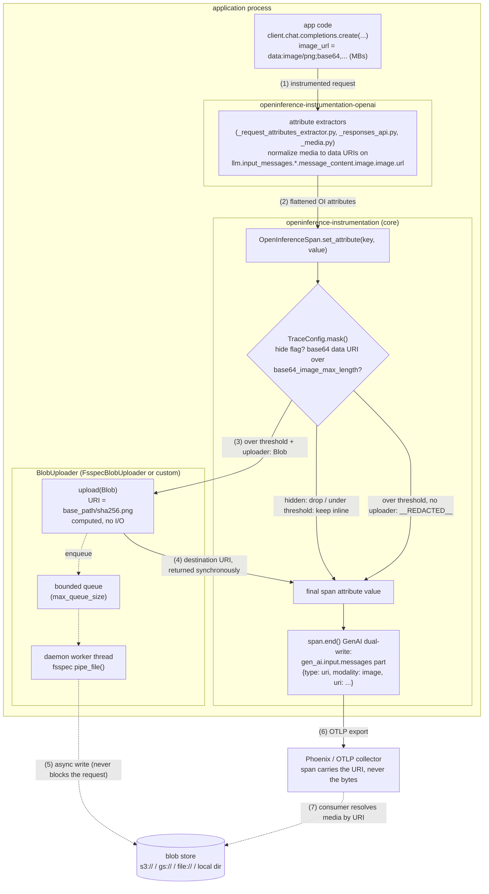

# Tech Spec: Large Multimodal Content Capture via Blob Upload

**Status:** Experimental (branch `experimental/multimodal-blob-upload`)
**Scope:** Python (`openinference-instrumentation`, `openinference-semantic-conventions`, `openinference-instrumentation-openai`), `spec/`
**Out of scope (this iteration):** JS/Java parity, Phoenix/backend rendering, URI resolution/proxying/signing
**Demo:** [`scripts/openai_image_blob_upload.py`](./scripts/openai_image_blob_upload.py) — a custom uploader on a live vision call, exported to Phoenix (`uv run --script …`; see [`scripts/README.md`](./scripts/README.md))

## 1. Problem

Modern LLM APIs accept and produce large binary content — audio (OpenAI chat completions
`input_audio` / audio-modality responses), PDF documents (chat completions `file` parts,
Responses API `input_file`), and images. Instrumentation that captures this content inline
records multi-megabyte base64 strings in span attributes, which:

- exceeds OTLP transport limits (gRPC default is 4 MB per message — the whole span batch
  is rejected, not just the attribute);
- inflates backend storage (span attributes are stored verbatim);
- is destroyed by the existing size guard: values over
  `OPENINFERENCE_BASE64_IMAGE_MAX_LENGTH` are replaced with `__REDACTED__`, so the
  content is unrecoverable.

Separately, before this branch the OpenAI instrumentor did not capture audio or file
content at all (`input_audio`, `input_file`, audio responses were TODOs), so there was
no observability for audio/document workloads.

## 2. Design overview

Two concerns, handled separately (mirroring the OTel GenAI semconv model):

1. **Capture normalization (per instrumentor).** Every extractor that meets binary
   content emits it in one canonical inline form: a `data:<mime>;base64,<payload>` URI on
   a media URL attribute (`…message_content.image.image.url`,
   `…message_content.audio.audio.url`, `…message_content.file.file.url`). Provider
   file ids (OpenAI Files API) are captured as `file.id` — a reference, never bytes.

2. **Externalization (central, config-driven).** A pluggable `BlobUploader` hook on
   `TraceConfig`, evaluated inside the existing `mask()` choke point that every attribute
   already passes through (`OpenInferenceSpan.set_attribute` → `TraceConfig.mask`). When
   an inline base64 data URI exceeds the size threshold and an uploader is configured,
   the decoded bytes are uploaded to external storage and the attribute records the
   destination URI instead. Instrumentors never talk to storage.

### Mental model — who decides what

Background for readers who don't live in OpenTelemetry: each instrumented LLM call
produces a **span** — one record of that call — carrying flat key/value **attributes**
(the model name, every message, and every image/audio/file inside those messages). An
**instrumentor** is the per-SDK library (here `openinference-instrumentation-openai`)
that watches SDK calls and writes those attributes. On the way onto the span, every
attribute passes through a single shared, config-driven checkpoint in the core library:
`TraceConfig.mask()`. Blob upload is one more rule at that checkpoint — not instrumentor
logic and not exporter logic.

Three questions, three owners:

| # | Question | Owner | How it decides |
|---|---|---|---|
| 1 | Is this content captured at all? | the **instrumentor** | its extractors must emit the media as a `data:<mime>;base64,…` URI on the standard `*.url` attribute key; content that is never captured can never be uploaded |
| 2 | Does it stay inline, get uploaded, or get redacted? | **core** (`TraceConfig.mask()`) | hide flags first (hidden content never reaches the uploader), then the size thresholds, then uploader presence — see the decision table in §4 |
| 3 | Where does it land and how does it get there? | the **`BlobUploader`** | destination and naming scheme, credentials, sync vs. background write, queueing, retries |

The uploader can only narrow, never widen: returning `None` from `upload()` (queue
full, shut down, or its own policy keyed off `blob.mime_type`/`blob.modality`) gets the
attribute redacted, but it cannot force below-threshold content to upload and never
sees content core hid or kept inline.

Practical consequences — what you touch to change what:

| You want to… | You change |
|---|---|
| turn on blob upload for media an instrumentor already captures (e.g. images in the OpenAI instrumentor) | configuration only — `TraceConfig(blob_uploader=…)` or `OPENINFERENCE_BLOB_UPLOAD_BASE_PATH`; zero code |
| store blobs your own way (bucket layout, artifact store, per-modality routing, mime-type refusal) | a `BlobUploader` class only (~20 lines; see the demo script) — no core or instrumentor changes |
| capture a modality an instrumentor doesn't emit yet (this branch: audio/files for OpenAI) | that instrumentor's extractors, normalizing to data URIs on the standard keys |
| change *what qualifies* for upload (e.g. per-modality thresholds) | core `TraceConfig` — a feature request, not an uploader implementation detail |

One structural exception to "instrumentors never deal with uploads": the serialized
`input.value` attribute, which instrumentors pre-process themselves — see §5.

### Architecture — blob upload path (OpenAI instrumentor example)



Solid arrows are the synchronous hot path of the instrumented request; dotted arrows
happen off it. The crux is (3)–(4): the destination name is derived from the content
itself (`sha256(bytes)`, §4), so the URI exists before any storage I/O and the request
thread never waits on the blob store — the bytes travel later through the bounded queue
(5), and the exported span (6) carries a short URI string regardless of media size. The
"GenAI dual-write" is an optional second emission of the same data under OTel `gen_ai.*`
keys (§6). Consumer-side resolution (7) is out of scope for this branch.

### Alignment with the OTel GenAI conventions

The three media forms map 1:1 onto the message-part model of the
[OTel GenAI semantic conventions][genai-repo] (maturity "Development", i.e. still
evolving; normative part schemas in [gen-ai-input-messages.json][genai-input-schema] /
[gen-ai-output-messages.json][genai-output-schema], added via
[semantic-conventions#2754][semconv-pr-2754] closing [#1556][semconv-issue-1556]):

| OpenInference representation | GenAI message part |
|---|---|
| `data:<mime>;base64,…` in `*.url` | `{"type": "blob", "modality", "mime_type", "content"}` |
| any other URI in `*.url` (https, s3, gs, …) | `{"type": "uri", "modality", "mime_type"?, "uri"}` |
| `file.id` | `{"type": "file", "modality", "file_id"}` |

The GenAI spec itself recommends "store content externally and record references on the
spans" for production ([gen-ai-spans.md][genai-spans]); after externalization the
dual-write emits spec-conformant `uri` parts with no extra work (§6; alternatives
considered in §9).

## 3. Semantic convention additions (`spec/`, `openinference-semantic-conventions`)

- New message content type `"file"` alongside `text`/`image`/`audio`/`reasoning`/`tool_use`.
- New constants:
  - `MessageContentAttributes.MESSAGE_CONTENT_AUDIO = "message_content.audio"`
  - `MessageContentAttributes.MESSAGE_CONTENT_FILE = "message_content.file"`
  - `FileAttributes.FILE_URL = "file.url"`
  - `FileAttributes.FILE_MIME_TYPE = "file.mime_type"`
  - `FileAttributes.FILE_NAME = "file.name"`
  - `FileAttributes.FILE_ID = "file.id"` — provider-assigned pre-uploaded file id
- `audio.url` / `file.url` explicitly admit three forms: http(s) URL, base64 data URI,
  external-storage URI. Spec text: `spec/multimodal_attributes.md`
  ("External Storage for Large Media"), `spec/semantic_conventions.md`,
  `spec/configuration.md`.

## 4. Core API (`openinference-instrumentation`)

New module `openinference/instrumentation/_blob_upload.py`; public exports `Blob`,
`BlobUploader`, `FsspecBlobUploader` from `openinference.instrumentation`.

```python
@dataclass(frozen=True)
class Blob:
    data: bytes                    # decoded payload
    mime_type: str                 # "audio/wav", "application/pdf", ...
    modality: str = ""             # "image"|"audio"|"video"|"document"; derived from mime
    attribute_key: Optional[str] = None   # span attribute the content came from
    content_sha256: str = ""       # hex digest of data; computed automatically

@runtime_checkable            # a Protocol: any object with these methods works,
class BlobUploader(Protocol):  # no base class to inherit (rationale in §9)
    def upload(self, blob: Blob) -> Optional[str]:
        """Return the destination URI immediately; write asynchronously.
        Return None if the blob cannot be accepted (caller falls back to
        redaction). Must never block the instrumented call path."""
    def shutdown(self, timeout_sec: float = 10.0) -> None: ...

class FsspecBlobUploader:  # implements BlobUploader
    def __init__(self, base_path: str, *, max_queue_size: int = 20): ...
```

### FsspecBlobUploader in depth

**What fsspec is and why it was chosen.** [fsspec](https://filesystem-spec.readthedocs.io/)
("filesystem spec") is the de-facto Python abstraction for file-like storage: one
`AbstractFileSystem` API implemented by pluggable backends for local disk, S3, GCS,
Azure, HTTP, in-memory, and dozens more. It is the same storage layer pandas, dask, and
Hugging Face datasets use to accept `s3://…` paths anywhere a filename is expected, and
what OTel's experimental [`UploadCompletionHook`][upload-hook-src] builds on. Building
the default uploader on fsspec means:

- one implementation covers every deployment target — the user changes a URI string,
  not code;
- credentials/config ride on each backend's standard mechanisms (e.g. `s3fs` honors
  `AWS_*` env vars / `~/.aws`, `gcsfs` honors Application Default Credentials) — the
  uploader itself never touches secrets;
- the storage dependency stays optional and user-chosen: the core package does not pull
  in boto3/google-cloud-storage; the user installs only the driver for their scheme.

| `base_path` example | Backend package needed | Notes |
|---|---|---|
| `/var/oi-media`, `file:///var/oi-media` | none | works even without fsspec installed (plain-`pathlib` fallback) |
| `s3://bucket/prefix` | `s3fs` | credentials via standard AWS config chain |
| `gs://bucket/prefix` | `gcsfs` | credentials via Application Default Credentials |
| `abfs://container/prefix` | `adlfs` | Azure Blob / Data Lake |
| `memory://oi-media` | none (ships with fsspec) | useful in tests |

fsspec itself is the `blob-upload` extra (`pip install
openinference-instrumentation[blob-upload]`); at construction time
`fsspec.url_to_fs(base_path)` resolves the URI scheme to a concrete filesystem object.
If fsspec is missing, local/`file://` destinations fall back to direct `pathlib` writes,
while remote schemes raise an `ImportError` naming the extra — failing fast at setup
rather than dropping blobs at runtime.

**Upload path.** `upload(blob)` runs on the instrumented call path, so everything it
does is O(hash) and memory-bounded:

1. Compute the destination name from the content: `{sha256(data)}{ext}`, extension
   mapped from the mime type (`.bin` fallback). The full URI `{base_path}/{name}` is
   therefore **deterministic before any I/O happens** — this is what lets `upload()`
   return synchronously while the bytes travel later.
2. Dedup: a digest set held for the uploader's lifetime means each unique payload is
   enqueued once, however many spans carry it; repeats return the same URI immediately.
3. Enqueue on a bounded queue (`max_queue_size`, default 20). If the queue is full —
   storage slower than the app produces media — `upload()` returns `None`.
4. A single daemon worker thread drains the queue and writes via
   `filesystem.pipe_file(path, data)` (an atomic whole-object write), creating parent
   directories where the backend has them.
5. `shutdown(timeout_sec)` flushes pending writes and stops the worker; afterwards
   `upload()` returns `None`. Call it at exit, next to `TracerProvider.shutdown()`.

**Failure semantics.**

| Failure | Behavior |
|---|---|
| queue full at capture time | `upload()` → `None`; attribute records `__REDACTED__` |
| backend write fails (network, permissions) | logged; the span keeps the already-recorded URI, which now dangles |
| process dies before the queue drains | same: at most `max_queue_size` dangling URIs |
| remote scheme without fsspec/driver installed | `ImportError` at uploader construction (fail-fast) |

The dangling-URI window is the deliberate price of never blocking the hot path;
consumers should treat "object not (yet) there" as retryable. Deployments that cannot
tolerate it can pass a custom `BlobUploader` that writes synchronously (the demo
script's `MyBlobUploader` does).

### TraceConfig integration

New fields / env vars (precedence: code > env > default, as with all existing fields):

| Field | Env var | Default |
|---|---|---|
| `hide_input_audio` | `OPENINFERENCE_HIDE_INPUT_AUDIO` | `False` |
| `hide_output_audio` | `OPENINFERENCE_HIDE_OUTPUT_AUDIO` | `False` |
| `hide_input_files` | `OPENINFERENCE_HIDE_INPUT_FILES` | `False` |
| `base64_media_max_length` | `OPENINFERENCE_BASE64_MEDIA_MAX_LENGTH` | `32_000` |
| `blob_uploader` | `OPENINFERENCE_BLOB_UPLOAD_BASE_PATH` (+ `OPENINFERENCE_BLOB_UPLOAD_MAX_QUEUE_SIZE`) | `None` |

Notes:

- `base64_image_max_length` is unchanged for images (back-compat); the new
  `base64_media_max_length` governs non-image media. It is *named* to cover video too,
  but today only audio and file attribute keys exist for it to match — no instrumentor
  captures video yet.
- Files get only an input-side hide flag because OpenAI has no file *outputs*; an
  output flag can be added when a surface exists. Audio has both directions
  (chat-completions audio responses are real).
- Setting `OPENINFERENCE_BLOB_UPLOAD_BASE_PATH` constructs a default
  `FsspecBlobUploader`; `blob_uploader=` in code takes precedence and accepts any
  `BlobUploader` implementation.
- The env var names deliberately parallel OTel's experimental
  `OTEL_INSTRUMENTATION_GENAI_UPLOAD_BASE_PATH` / `..._UPLOAD_MAX_QUEUE_SIZE`
  ([`opentelemetry-util-genai`][util-genai-pypi]) so a future aliasing is mechanical.

### mask() decision table

Evaluated per attribute in `OpenInferenceSpan.set_attribute`, in order (pre-existing
rules — image/text hiding, embeddings, etc. — are unchanged and elided):

```
hide_input_audio  + input  message audio key            → drop (None)
hide_output_audio + output message audio key            → drop (None)
hide_input_files  + input  message file key             → drop (None)
image data URI > base64_image_max_length on image.url   → upload → URI, else __REDACTED__
media data URI > base64_media_max_length on audio.url
  or file.url (input or output messages)                → upload → URI, else __REDACTED__
otherwise                                               → unchanged
```

Invariants (the canonical statement of the fallback behavior):

- Hide settings take precedence over externalization — hidden content is never uploaded.
- Small payloads (≤ threshold) stay inline as data URIs (GenAI `blob` parts).
- No uploader, upload rejection, or upload failure all degrade to `__REDACTED__`
  (today's over-limit behavior) — and never block the instrumented call.

## 5. OpenAI instrumentor capture (`openinference-instrumentation-openai`)

New helpers `_media.py` (format→mime maps, data-URI builders) and `_media_utils.py`
(request-payload processing). Capture added:

| Surface | Content | Attributes emitted |
|---|---|---|
| Chat Completions request | `input_audio` part | `message_content.type="audio"`, `audio.url` (data URI), `audio.mime_type` |
| Chat Completions request | `file` part | `message_content.type="file"`, `file.url` (data URI, from `file_data`), `file.mime_type` (guessed from `filename`), `file.name`, `file.id` |
| Chat Completions response | `message.audio` (`ChatCompletionAudio`) | `message.contents.0.…type="audio"`, `audio.url` (data URI; format read from request `audio.format`), `audio.mime_type`, `audio.transcript`, `message_content.id` |
| Responses API request | `input_audio` part | as chat `input_audio` |
| Responses API request | `input_file` part | `file.url` (from `file_url`, else data URI from `file_data`), `file.mime_type`, `file.name`, `file.id` |

**The `input.value` exception.** Instrumentors also JSON-serialize the whole raw
request into the `input.value` attribute *before* it reaches `mask()`, which won't
parse arbitrary JSON to find base64 buried inside. So the instrumentor pre-processes
that one payload itself: `redact_media_from_request_parameters` (analogous to the
existing image redaction) walks chat `messages[].content[]` and Responses
`input[].content[]`, and applies the same hide → externalize → redact policy to
`input_audio.data` / `file.file_data` / `input_file.file_data` via the same shared
uploader. Content addressing makes the double touch (structured attribute +
`input.value`) resolve to one upload and one URI.

## 6. GenAI dual-write conversion (`_genai_conversion.py`)

`_image_part_from_url` generalized to `_media_part_from_url(url, modality, mime_type=None)`;
new `_file_part_from_id`. Conversion coverage (both the flattened-attribute path and the
marshaled-JSON path):

- `message_content.audio.audio.url` → `blob` (data URI) or `uri` part, `modality="audio"`,
  carrying `audio.mime_type` when present.
- `message_content.file.file.url` → `blob`/`uri` part, `modality="document"`, carrying
  `file.mime_type`.
- `message_content.file.file.id` (no url) → `file` part with `file_id`.
- `GenAIModalityValues` gains `DOCUMENT = "document"` (matches the semconv
  [`Modality` enum][genai-input-schema]: `image | video | audio | document`).

Output is validated in tests against the vendored OTel GenAI JSON schemas
(`tests/fixtures/genai_schemas/`, from [semantic-conventions v1.41.1][semconv-v1411]),
which already define `BlobPart`/`UriPart`/`FilePart`.

## 7. End-to-end example

```python
from openinference.instrumentation import TraceConfig, FsspecBlobUploader
from openinference.instrumentation.openai import OpenAIInstrumentor

config = TraceConfig(
    blob_uploader=FsspecBlobUploader(base_path="s3://my-bucket/oi-media"),
)
OpenAIInstrumentor().instrument(tracer_provider=tracer_provider, config=config)
```

A chat completion with a 5 MB WAV input produces (audio over the 32k default threshold;
the doubled `audio.audio` segment is the flattening of `message_content.audio` +
`audio.url`):

```
llm.input_messages.0.message.contents.1.message_content.type       = "audio"
llm.input_messages.0.message.contents.1.…audio.audio.url           = "s3://my-bucket/oi-media/3a7bd3….wav"
llm.input_messages.0.message.contents.1.…audio.audio.mime_type     = "audio/wav"
```

and, with `enable_genai_semconv=True`, `gen_ai.input.messages` contains
`{"type": "uri", "modality": "audio", "mime_type": "audio/wav", "uri": "s3://…/3a7bd3….wav"}`.
Without an uploader the oversized audio is `__REDACTED__` per the §4 invariants; under
the threshold it stays inline. (For audio/files even that fallback is new coverage —
see §1.)

## 8. Testing

- `openinference-instrumentation/tests/test_blob_upload.py` — uploader semantics
  (content addressing, dedup, shutdown, protocol conformance), all mask() paths
  (upload/redact/inline/hide/precedence/env-var construction), custom uploader injection.
- `openinference-instrumentation/tests/test_genai.py::test_get_genai_attributes_maps_audio_and_file_parts`
  — blob/uri/file part conversion, schema-validated.
- `openinference-instrumentation-openai/tests/.../test_multimodal_media.py` — extractor
  coverage for all five capture surfaces plus `input.value` redaction/externalization.

Known pre-existing (unrelated) issue: `test_tool_calls.py::test_tool_calls` fails when the
openai suite runs in one process on this branch's base commit as well (span-count
pollution from test ordering).

## 9. Design decisions & alternatives considered

- **Per-part URI substitution over whole-payload `*_ref` upload.** OTel's
  [`UploadCompletionHook`][upload-hook-src] uploads the entire inputs/outputs JSON and
  stamps `gen_ai.input.messages_ref` (implementation-defined names, not in the semconv
  registry — a generic `*.blob_ref.*` convention was proposed in
  [semantic-conventions#1521][semconv-pr-1521] but closed unmerged). Per-part
  substitution keeps text/tool-call content queryable inline, works with OpenInference's
  flattened attribute model, and produces registry-shaped `uri` parts. A whole-payload
  `input.value.ref` escape hatch remains a possible follow-up.
- **Protocol, not base class.** Any object with `upload`/`shutdown` works
  (`@runtime_checkable`), enabling adapters over OTel's BlobUploader work
  (Google's proposal in [opentelemetry-python-contrib#3065][contrib-3065]:
  `upload_async(blob) -> uri` returning the destination immediately with a background
  write — the same shape adopted here), OpenLLMetry-style image uploaders, or in-house
  stores without inheriting from us.
- **`is_base64_url` untouched.** The image-only helper keeps its semantics for
  back-compat; a new generic `is_base64_media_url` covers all media data URIs.

## 10. Follow-ups (not in this branch)

- **JS parity:** `blobUploader` on `@arizeai/openinference-core` TraceConfig + a masking
  rule beside `maskLongBase64ImageRule`, with the same content-hash URI trick.
- **openai-agents realtime migration:** `_realtime.py` has private audio env vars
  (`OPENINFERENCE_HIDE_INPUT_AUDIO`, `OPENINFERENCE_BASE64_AUDIO_MAX_LENGTH`) and custom
  `input.audio.url` attribute names; migrate onto the core config fields and
  `message_content.audio` conventions.
- **Image externalization inside `input.value`:** images in `input.value` still redact
  (only the structured attribute externalizes); unify by extending the image redaction
  pass to accept the uploader.
- **Remaining OpenAI TODOs:** `image_generation_call` output, code-interpreter file
  outputs, speech/transcription endpoints.
- **Other instrumentors:** litellm image-gen `b64_json`, Anthropic document blocks,
  Google GenAI inline_data.
- **Consumer support (Phoenix/Arize):** audio rendering from `message_content.audio`,
  URI resolution/signing for `s3://`/`gs://` schemes.
- **Upstream convergence:** if/when OTel stabilizes upload env vars or a registry-blessed
  reference convention, alias `OPENINFERENCE_BLOB_UPLOAD_*` accordingly.

## 11. References

OTel GenAI semantic conventions:

- [semantic-conventions-genai repo][genai-repo] — home of the GenAI semconv
  ([moved notice](https://opentelemetry.io/docs/specs/semconv/gen-ai/))
- [gen-ai-spans.md][genai-spans] — message attributes and content-recording modes
- [gen-ai-input-messages.json][genai-input-schema] / [gen-ai-output-messages.json][genai-output-schema] — normative message-part schemas
- [semantic-conventions#1556][semconv-issue-1556] / [#2754][semconv-pr-2754] — multimodal part types (issue / merged PR)
- [semantic-conventions#1521][semconv-pr-1521] — `*.blob_ref.*` proposal, closed unmerged (see §9)
- [v1.41.1 gen-ai docs][semconv-v1411] — source of the vendored test schemas

OTel reference implementations:

- [opentelemetry-python-genai repo][python-genai-repo] — GenAI instrumentations and `util/opentelemetry-util-genai`
- [opentelemetry-util-genai on PyPI][util-genai-pypi] — capture-mode and upload env vars
- [UploadCompletionHook source][upload-hook-src] — whole-payload uploader (contrast in §9)
- [opentelemetry-python-contrib#3065][contrib-3065] — Google's BlobUploader proposal (shape adopted here, §9)

Storage layer:

- [fsspec documentation](https://filesystem-spec.readthedocs.io/) and its
  [backend registry](https://filesystem-spec.readthedocs.io/en/latest/api.html#other-known-implementations)
  (scheme → driver mapping: `s3fs`, `gcsfs`, `adlfs`, …)

[genai-repo]: https://github.com/open-telemetry/semantic-conventions-genai
[genai-spans]: https://github.com/open-telemetry/semantic-conventions-genai/blob/main/docs/gen-ai/gen-ai-spans.md
[genai-input-schema]: https://github.com/open-telemetry/semantic-conventions-genai/blob/main/model/gen-ai/gen-ai-input-messages.json
[genai-output-schema]: https://github.com/open-telemetry/semantic-conventions-genai/blob/main/model/gen-ai/gen-ai-output-messages.json
[semconv-issue-1556]: https://github.com/open-telemetry/semantic-conventions/issues/1556
[semconv-pr-2754]: https://github.com/open-telemetry/semantic-conventions/pull/2754
[semconv-pr-1521]: https://github.com/open-telemetry/semantic-conventions/pull/1521
[semconv-v1411]: https://github.com/open-telemetry/semantic-conventions/tree/v1.41.1/docs/gen-ai
[python-genai-repo]: https://github.com/open-telemetry/opentelemetry-python-genai
[util-genai-pypi]: https://pypi.org/project/opentelemetry-util-genai/
[upload-hook-src]: https://github.com/open-telemetry/opentelemetry-python-genai/tree/main/util/opentelemetry-util-genai
[contrib-3065]: https://github.com/open-telemetry/opentelemetry-python-contrib/issues/3065
