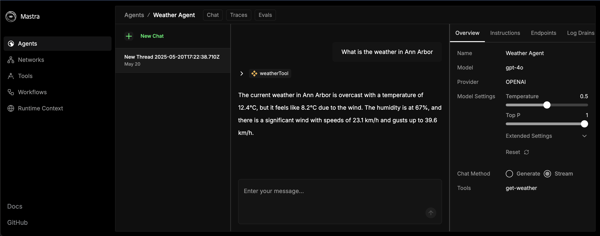
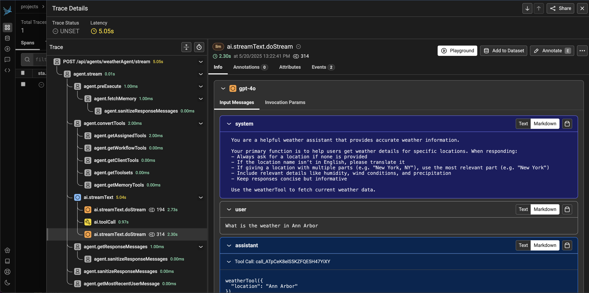

# OpenInference Mastra

[](https://badge.fury.io/js/@arizeai%2Fopeninference-mastra)

This package provides a set of utilities to ingest [Mastra](https://github.com/mastra-ai/mastra) spans into platforms like [Arize](https://arize.com/) and [Arize Phoenix](https://phoenix.arize.com/).

## Installation

```shell
npm install --save @arizeai/openinference-mastra
```

A typical Mastra project will already have OpenTelemetry and related packages installed, so you will likely not need to install any additional packages.

## Usage

`@arizeai/openinference-mastra` provides a set of utilities to help you ingest Mastra spans into the Phoenix platform (and any other OpenInference-compatible platform) and works in conjunction with Mastra's OpenTelemetry support. To get started, you will need to add OpenTelemetry support to your Mastra project according to the [Mastra Observability guide](https://mastra.ai/en/reference/observability/providers), or, follow along with the rest of this README.

To process your Mastra spans add an `OpenInferenceOTLPTraceExporter` to your `telemetry` configuration within your `Mastra` instance.

Here is an example of how to configure a `Mastra` instance to export spans to Arize Phoenix:

```shell
# Set the Phoenix collector endpoint and API key in your environment
export PHOENIX_COLLECTOR_ENDPOINT="https://localhost:6006/v1/traces"
export PHOENIX_API_KEY="your-api-key"
```

```typescript
import { Mastra } from "@mastra/core";
import {
  OpenInferenceOTLPTraceExporter,
  isOpenInferenceSpan,
} from "@arizeai/openinference-mastra";

export const mastra = new Mastra({
  // ... other config
  telemetry: {
    serviceName: "openinference-mastra-agent", // you can rename this to whatever you want to appear in the Phoenix UI
    enabled: true,
    export: {
      type: "custom",
      exporter: new OpenInferenceOTLPTraceExporter({
        url: process.env.PHOENIX_COLLECTOR_ENDPOINT,
        headers: {
          Authorization: `Bearer ${process.env.PHOENIX_API_KEY}`,
        },
        // optional: filter out http, and other node service specific spans
        // they will still be exported to Mastra, but not to the target of
        // this exporter
        spanFilter: isOpenInferenceSpan,
      }),
    },
  },
});
```

For general details on Mastra's OpenTelemetry support see the [Mastra Observability guide](https://mastra.ai/en/docs/observability/tracing).

## Examples

### Weather Agent

To setup the canonical Mastra weather agent example, and then ingest the spans into Arize Phoenix (or any other OpenInference-compatible platform), follow the steps below.

- Create a new Mastra project

```shell
npm create mastra@latest
# answer the prompts, include agent, tools, and the example when asked
cd chosen-project-name
npm install --save @arizeai/openinference-mastra
# export some variables for mastra to use later on
export PHOENIX_COLLECTOR_ENDPOINT="http://localhost:6006/v1/traces"
export PHOENIX_API_KEY="your-api-key"
export OPENAI_API_KEY="your-openai-api-key"
```

- Add the OpenInferenceOTLPTraceExporter to your Mastra project

```typescript
// chosen-project-name/src/index.ts
import { Mastra } from "@mastra/core/mastra";
import { createLogger } from "@mastra/core/logger";
import { LibSQLStore } from "@mastra/libsql";
import {
  isOpenInferenceSpan,
  OpenInferenceOTLPTraceExporter,
} from "@arizeai/openinference-mastra";

import { weatherAgent } from "./agents";

export const mastra = new Mastra({
  agents: { weatherAgent },
  storage: new LibSQLStore({
    url: ":memory:",
  }),
  logger: createLogger({
    name: "Mastra",
    level: "info",
  }),
  telemetry: {
    enabled: true,
    serviceName: "weather-agent",
    export: {
      type: "custom",
      exporter: new OpenInferenceOTLPTraceExporter({
        url: process.env.PHOENIX_COLLECTOR_ENDPOINT,
        headers: {
          Authorization: `Bearer ${process.env.PHOENIX_API_KEY}`,
        },
        spanFilter: isOpenInferenceSpan,
      }),
    },
  },
});
```

- Run the agent

```shell
npm run dev
```

- Send a chat message to the agent in the playground [http://localhost:4111/agents/weatherAgent/chat/](http://localhost:4111/agents/weatherAgent/chat/)



- After a few moments, you should see the spans for the agent's request and response in Phoenix.
  - Not sure how to run the Phoenix collector? [Check out the Phoenix docs](https://docs.arize.com/phoenix/self-hosting/deployment-options/docker#docker).



You've done it! For next steps, check out the [Mastra docs](https://mastra.ai/en/docs) to learn how to add more agents, tools, and storage options to your project.
