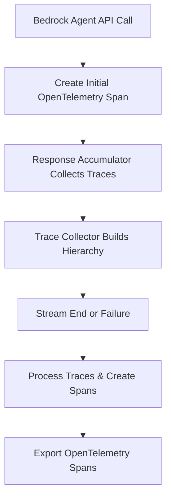
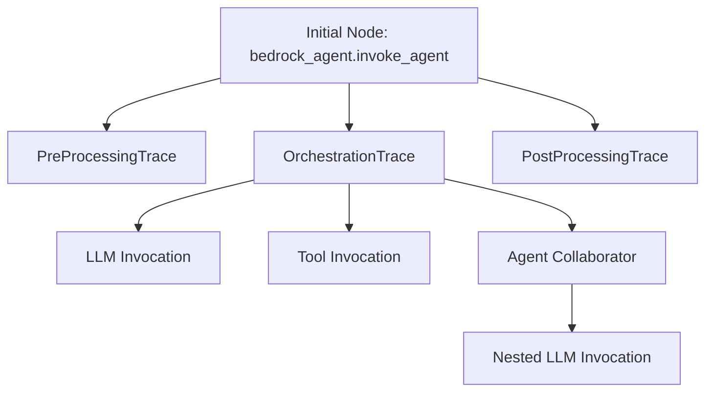
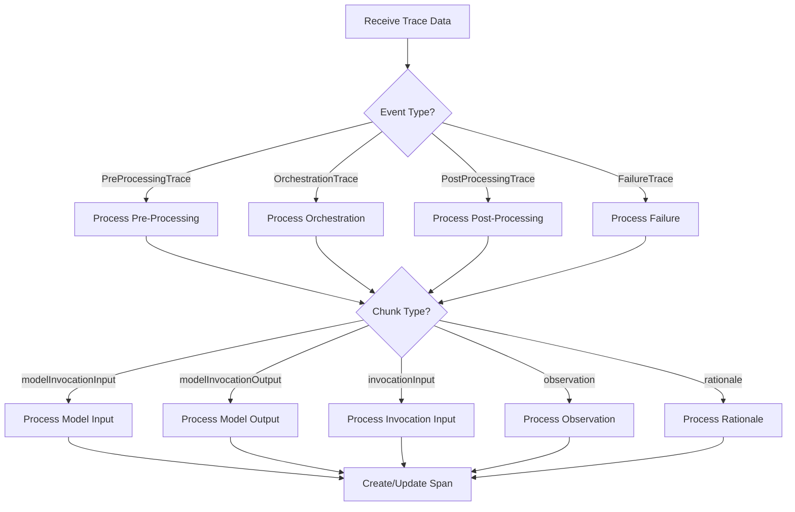

# Amazon Bedrock Agent Instrumentation

This document provides a detailed technical overview of the OpenInference instrumentation implementation for Amazon Bedrock Agents.

## Architecture Overview

The Bedrock Agent instrumentation consists of three main components:

1. **Response Accumulator**: Processes responses from Bedrock services and creates OpenTelemetry spans
2. **Trace Manager**: Organizes bedrock trace data into a hierarchical structure
3. **Attribute Extractor**: Extracts attributes from various types of trace data and converts to opentelemetry compatible attributes.

### Execution Flow

1. When `invoke_agent` is called, an initial OpenTelemetry span is created
2. As the agent streams responses, the Response Accumulator collects all traces from Bedrock
3. The Trace Collector builds trace nodes in hierarchical order as traces arrive
4. Once all traces are streamed (indicated by StopIterationException) or a failure occurs, the system starts building spans using the collected trace hierarchy
5. The Response Accumulator processes all the traces in hierarchical order using recursion to create the final OpenTelemetry spans



## Component Details

### Response Accumulator (`_response_accumulator.py`)

The Response Accumulator is the entry point for processing responses from Bedrock services. It acts as a callback for streaming responses and extracts telemetry data.

#### Key Classes

-   **`_Attributes`**: Container for span attributes and metadata
-   **`_ResponseAccumulator`**: Processes responses and creates spans

#### Main Functionality

1. **Response Processing**: The `__call__` method processes each chunk of data received from Bedrock
2. **Trace Collection**: Collects trace data using the `TraceCollector` during streaming
3. **Trace Processing**: Once streaming ends, processes all collected traces in hierarchical order
4. **Span Creation**: Creates OpenTelemetry spans recursively based on the trace hierarchy
5. **Attribute Extraction**: Extracts attributes from trace data using the `AttributeExtractor`

### Trace Manager (`_trace_manager.py`)

The Trace Manager organizes trace data into a hierarchical structure that represents the execution flow of the Bedrock Agent.

#### Key Classes

-   **`TraceSpan`**: Represents a span within a trace that contains chunks of data
-   **`TraceNode`**: Represents a node in the trace tree that can contain multiple spans
-   **`TraceStack`**: Manages a stack of TraceNodes for tracking the current execution context
-   **`TraceCollector`**: Collects and organizes trace data into a hierarchical structure as it arrives

#### Main Functionality

1. **Trace Collection**: The `collect` method processes incoming trace data in real-time
2. **Node Management**: Creates and manages TraceNodes based on trace data
3. **Hierarchy Building**: Builds a hierarchical structure of traces as data streams in
4. **Stack Management**: Uses a stack to maintain the current context during trace processing
5. **Span Organization**: Organizes spans within nodes for later processing

#### Trace Hierarchy



### Attribute Extractor (`_attribute_extractor.py`)

The Attribute Extractor extracts attributes from various types of trace data generated by Bedrock services.

#### Main Functionality

1. **Event Type Detection**: Identifies the type of trace event
2. **Attribute Extraction**: Extracts attributes from different types of events
3. **Message Processing**: Processes message objects from trace data
4. **Token Counting**: Extracts token usage information
5. **Trace ID Extraction**: Extracts trace IDs from trace data

#### Supported Event Types

-   Model Invocation Input/Output
-   Action Group Invocation
-   Code Interpreter Invocation
-   Knowledge Base Lookup
-   Agent Collaborator Invocation
-   Rationale
-   Failure Trace

### Trace Processing Flow



## Key Concepts

### Trace Types

-   **PreProcessingTrace**: Traces related to pre-processing steps before agent execution
-   **OrchestrationTrace**: Traces related to the main agent execution flow
-   **PostProcessingTrace**: Traces related to post-processing steps after agent execution
-   **FailureTrace**: Traces related to failures during agent execution

### Span Types

-   **LLM**: Spans for LLM model invocations
-   **CHAIN**: Spans for orchestration chains
-   **AGENT**: Spans for agent collaborator invocations
-   **TOOL**: Spans for tool invocations (action groups, code interpreter, knowledge base)
-   **RETRIEVER**: Spans for knowledge base retrievals

### Trace Hierarchy

The trace hierarchy represents the execution flow of the Bedrock Agent:

1. **Root Node**: The initial node representing the agent invocation
2. **Trace Nodes**: Nodes representing different trace types (pre-processing, orchestration, post-processing)
3. **Spans**: Individual spans within nodes representing specific operations (LLM invocations, tool calls)

## Implementation Details

### Response Accumulator

The Response Accumulator processes responses from Bedrock services and creates OpenTelemetry spans:

1. **Initialization**: Creates a TraceCollector and initializes span tracking with a parent span
2. **Streaming Collection**: Processes each chunk of data from the response stream as it arrives
3. **Trace Collection**: Collects trace data using the TraceCollector during streaming
4. **Recursive Span Creation**: Once streaming ends, recursively creates spans based on the collected trace hierarchy
5. **Attribute Extraction**: Extracts attributes from trace data using the AttributeExtractor
6. **Span Timing**: Sets start and end times for spans based on metadata extracted from traces
7. **Exception Handling**: Handles exceptions and records them in spans

### Trace Manager

The Trace Manager organizes trace data into a hierarchical structure as it arrives:

1. **Real-time Processing**: Processes trace data as it streams in from Bedrock
2. **Node Creation**: Creates TraceNodes for different trace types (preprocessing, orchestration, etc.)
3. **Stack Management**: Uses a TraceStack to track the current execution context during trace collection
4. **Chunk Processing**: Processes chunks of data and adds them to the appropriate spans
5. **Hierarchical Organization**: Builds a hierarchical structure of traces that mirrors the agent's execution flow

### Attribute Extractor

The Attribute Extractor extracts attributes from trace data:

1. **Event Type Detection**: Identifies the type of trace event
2. **Attribute Extraction**: Extracts attributes from different types of events
3. **Message Processing**: Processes message objects from trace data
4. **Token Counting**: Extracts token usage information
5. **Trace ID Extraction**: Extracts trace IDs from trace data

## Usage Examples

### Basic Usage

```python
from openinference.instrumentation.bedrock import BedrockInstrumentor

# Enable instrumentation
BedrockInstrumentor().instrument()

# Use Bedrock client as normal
import boto3
bedrock_agent_runtime = boto3.client(
    service_name="bedrock-agent-runtime",
    region_name="us-west-2"
)

# Invoke agent
response = bedrock_agent_runtime.invoke_agent(
    agentId="your-agent-id",
    agentAliasId="your-alias-id",
    inputText="Hello, agent!",
    enableTrace=True,
    sessionId="default-xyz"
)

# Process response
for event in response["completion"]:
    if "chunk" in event:
        print(event["chunk"]["bytes"].decode())
    elif "trace" in event:
        print(event["trace"])
```

### Accessing Trace Data

The instrumentation automatically creates OpenTelemetry spans that can be exported to observability backends:

```python
from opentelemetry import trace
from opentelemetry.sdk.trace import TracerProvider
from opentelemetry.sdk.trace.export import ConsoleSpanExporter, SimpleSpanProcessor

# Set up OpenTelemetry
trace.set_tracer_provider(TracerProvider())
trace.get_tracer_provider().add_span_processor(
    SimpleSpanProcessor(ConsoleSpanExporter())
)

# Enable instrumentation
from openinference.instrumentation.bedrock import BedrockInstrumentor
BedrockInstrumentor().instrument()

# Use Bedrock client as normal
# Spans will be exported to the console
```

## Amazon Bedrock Agent Setup

This section provides guidance on setting up Amazon Bedrock Agents for use with OpenInference instrumentation.

### Prerequisites

-   AWS account with Bedrock access in your region
-   IAM permissions for:
    -   Bedrock
    -   Lambda (for tools)
    -   Open Search or Pinecone (for vector stores)

### Creating an Agent in Amazon Bedrock

1. **Define the Agent Purpose**

    - Clarify the tasks your agent will perform (answer FAQs, perform task automation, query documents, run calculations)

2. **Create the Agent**

    - Go to **Amazon Bedrock > Agents**
    - Click **Create agent**
    - Fill out:
        - Agent name
        - Instruction prompt
        - Foundation model (e.g., `claude 3.5 sonnet`)
        - Idle session TTL

3. **Configure Action Groups Using Lambda for Tools**

    - Create a Lambda function in AWS Lambda Console
    - In your agent's **Action Groups** tab, click **Add**
    - Configure the action group with name, description, and Lambda function
    - Define input parameters
    - Link the Action Group to your agent

4. **Configure and Attach a Knowledge Base**

    - Create a Knowledge Base in **Bedrock > Knowledge bases**
    - Configure data source, storage, and processing
    - Choose Embeddings Model and Vector Database
    - In agent settings, attach the Knowledge Base

5. **Enable Code Interpreter**
    - Go to **Amazon Bedrock > Agents**
    - Open your agent and go to **Agent settings**
    - Scroll to **Tools** section
    - Enable **code interpreter**

### Testing the Agent with Tracing

```python
import boto3
session = boto3.session.Session()
client = session.client("bedrock-agent-runtime", "us-east-1")
response = client.invoke_agent(
    agentId='your-agent-id',
    sessionId='demo-session',
    inputText='Can you calculate the average order value from $120, $150, and $90?',
    enableTrace=True  # Enable tracing for instrumentation
)
for idx, event in enumerate(response["completion"]):
    if "chunk" in event:
        print(event)
        chunk_data = event["chunk"]
        if "bytes" in chunk_data:
            output_text = chunk_data["bytes"].decode("utf8")
            print(output_text)
    elif "trace" in event:
        print(event["trace"]["trace"])
```

### Trace Events and Agent Configuration

When tracing is enabled, the system captures traces for the following stages of agent execution:

#### 1. PreProcessing

This stage evaluates user input—e.g., checking if it's safe or non-harmful. It involves an LLM invocation to perform this evaluation. If `preProcessing` is enabled at the agent level and tracing is turned on, these LLM calls will be captured and returned in the trace.

#### 2. Orchestration

When orchestration is enabled, the agent determines which AWS services to invoke based on the user input:

-   After preProcessing passes, the agent sends the input to the LLM
-   The LLM decides the next step (e.g., calling an ActionGroup or Knowledge Base)
-   The agent then invokes the corresponding tool

Traces captured during orchestration include:

-   `invocationInput`: Input to the selected Agent Tool
-   `invocationOutput`: Output returned from the tool

#### 3. PostProcessing

After the LLM generates a final response, it is passed through a post-processing phase—again, an LLM invocation—to validate or refine the output before returning it to the user.

#### Model Invocation Traces

Each LLM interaction—whether during preProcessing, orchestration, or postProcessing—will include:

-   `modelInvocationInput`
-   `modelInvocationOutput`

These traces align with the span types and trace hierarchy described in the Architecture Overview section of this document.

## Conclusion

The OpenInference instrumentation for Amazon Bedrock Agents provides a comprehensive solution for tracing and telemetry collection. By capturing detailed information about agent interactions, it enables developers to monitor, debug, and analyze agent behavior effectively.

The implementation uses a modular architecture with clear separation of concerns:

-   The Response Accumulator processes responses and creates spans
-   The Trace Manager organizes trace data into a hierarchical structure
-   The Attribute Extractor extracts attributes from trace data

This design allows for flexible and extensible instrumentation that can adapt to changes in the Bedrock Agent API and support new features as they are added.
